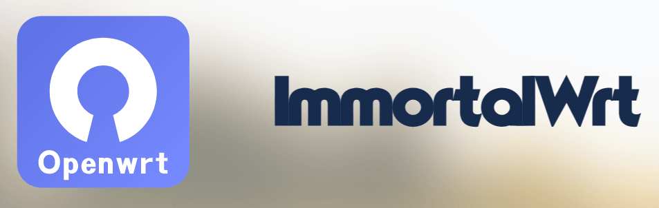

# 为 360T7 云编译 ImmortalWrt


## 🗂️ 项目结构
   ```
ImmortalWrt-360T7/ 
├── .github/ 
│   └── workflows/         # GitHub Actions 工作流配置
│       └── *.yml          # 自动化编译流程定义
├── diy-part1.sh           # 更新feeds前的配置，如三方订阅源或依赖源等
├── diy-part2.sh           # 更新feeds后的配置，如自定义默认网关、固件版本名称自定义
├── pure.config            # 编译配置文件
├── README.md              # 项目说明文档
├── LICENSE                # MIT许可证
└── logo.png               # 本项目标识图
   ```


## 🤖关于固件

  | 默认网关    | 默认用户     | 默认密码     |
  | -------- | -------- | -------- |
  | 192.168.77.1 | root | -- |


- 内置构建了OpenClash及其相关依赖
- `hanwckf` & `padavanonly` 多版本（含24.10），各位酌情自取  
- 亦欢迎 Frok & Star

## ❤️感谢
- hanwckf：https://github.com/hanwckf/immortalwrt-mt798x  
- padavanonly：https://github.com/padavanonly/immortalwrtARM 、https://github.com/padavanonly/immortalwrt-mt798x-24.10
- Actions-OpenWrt：https://github.com/P3TERX/Actions-OpenWrt
